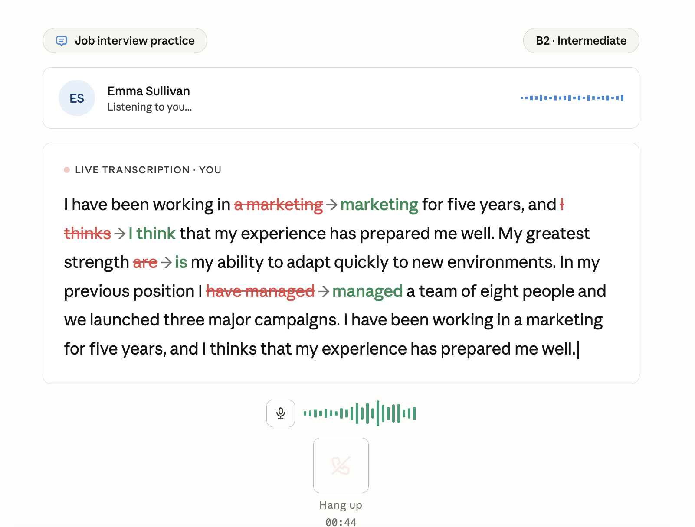
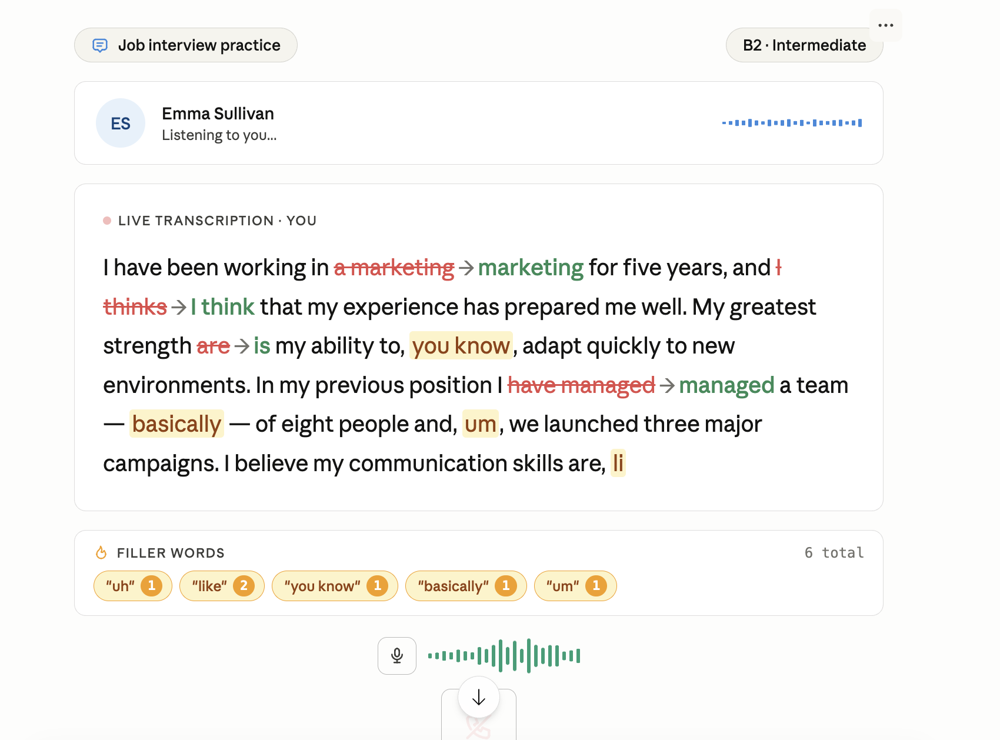

# Features

## Inline Correction

While the user speaks, text appears normally in the transcription. A few seconds after finishing the sentence, words with errors transform in place within the text: the mistake appears struck through in red, followed by an arrow and the correct version in green. No popups, no floating elements — everything happens inside the text flow.

The behavior has three phases:

- **Live typing** — the incorrect word is typed normally, with no visual indication that there's an issue, so as not to interrupt the speaking flow.
- **Deferred correction** — approximately 2 seconds after the sentence is complete, the incorrect word is visually replaced with the format ~~error~~ → correction. If there are multiple errors in the same sentence, they appear one by one with a small interval between them.
- **Persistence** — the correction stays visible on screen permanently, allowing the user to review their mistakes in context while the conversation continues.

## Real-time Filler Word Tracker

As the user speaks, filler words are detected instantly and highlighted in amber directly within the transcription text, without interrupting the flow of the conversation.

The tracker card below the transcription updates in real time with three elements:

- **Amber chips** — one chip per unique filler word detected. Each chip shows the word and a small orange counter badge with the number of times it has been used in the session. New chips appear with a pop-in animation the first time a word is detected.
- **Bump animation** — every time a previously detected filler word appears again, its chip bounces to draw the user's attention to the repetition.
- **Total counter** — top right of the tracker card, shows the running total of all filler words across the session.

At the end of the session, when the user hangs up, the tracker resets completely to zero — chips are cleared and the counter goes back to "0 total", ready for the next session.

# Problems

## In line correction

It has some problems detecteing correction in real time. Evaluate them. 

## Real-time Filler Word Tracker

The Deepgram v6 SDK redesigned its WebSocket client. The `client.listen.v1.connect()` method has a strict explicit parameter signature — it does not accept free `**kwargs`. The `filler_words` parameter exists in the batch transcription client (REST) but was never exposed in the real-time WebSocket client.

When Pipecat builds the connection kwargs via `_build_connect_kwargs()` and includes `filler_words`, the SDK rejects it with `unexpected keyword argument`.

**Current workaround — `smart_format=False`:** Deepgram enables `smart_format` by default, which applies post-processing to the transcript and strips out filler sounds ("um", "uh", "hmm"). Disabling it lets the raw transcript through with the exact words spoken, including fillers.

**Limitation:** with `smart_format=False`, only written filler words (e.g. "like", "basically", "you know") are detected — not vocal hesitations ("um", "uh", "hmm"), which Deepgram never transcribes in real-time mode regardless of settings.

**Future improvement:** record and store the full session audio, then run a batch transcription at the end of the call. The batch API supports `filler_words=True` natively, which would capture hesitations as well.